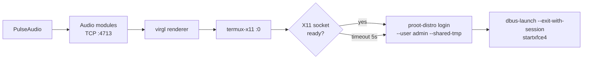
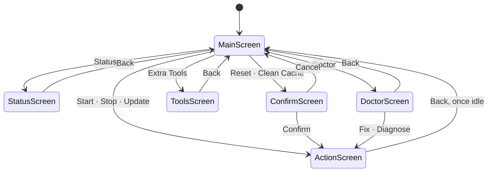
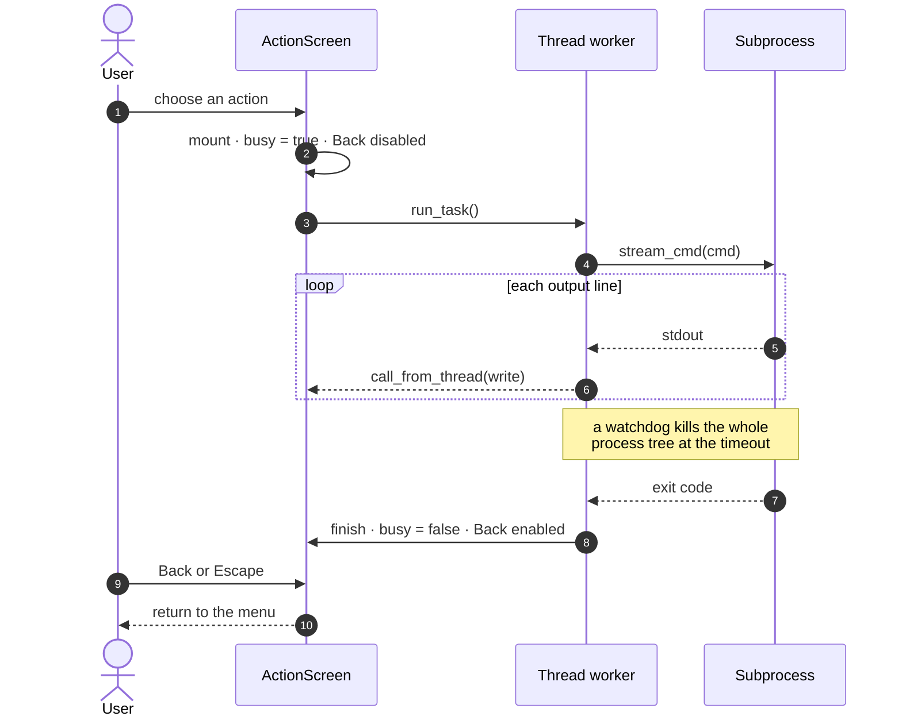

<div align="center">
  <h1>📱 arinanoLabs</h1>
  <p><strong>Your phone is a Linux workstation — ~30s to a working desktop, not 30 minutes of apt.</strong></p>
  <p>
    <a href="https://github.com/arinadi/arinanoLabs/actions"></a>
    <a href="https://github.com/arinadi/arinanoLabs/blob/main/LICENSE"></a>
  </p>

  ```bash
  curl -sL https://raw.githubusercontent.com/arinadi/arinanoLabs/main/install.sh | bash
  ```

  
  <p>
    Debian 13 &nbsp;·&nbsp; Xfce4 &nbsp;·&nbsp; Firefox ESR &nbsp;·&nbsp; Dev tools<br>
    <small>TermuX → X11 → LinuX → Trixie → Xfce4</small>
  </p>
</div>

---

## ⚡ Why

Your Android phone is a pocket PC with 8GB+ RAM and an ARM64 CPU — it deserves a real desktop. If you've already fought your way through a manual proot install, you know where the pain is. arinanoLabs fixes it declaratively:

| Problem | arinanoLabs Solution |
|---------|----------------------|
| Chrome sleeps tabs | Firefox ESR desktop browser — stays alive |
| No glibc apps | Debian 13 proot — standard glibc |
| No dev tools | Node.js 22, Python 3, GCC, CMake built-in |
| 30 min of apt + config | Pre-built OCI image, pulled in one step |
| Fiddly X11 + audio + dbus startup | One menu entry, with cleanup on stop |
| No touch keyboard | Onboard on-screen keyboard, autostarted |

**What this can't do:** no Docker, no systemd services, no native x86, no root (proot emulates root-like behavior, not real root). Full details in [Limitations](#️-limitations).

---

## 🚀 Quick Start

### Install (one-time)

```bash
curl -sL https://raw.githubusercontent.com/arinadi/arinanoLabs/main/install.sh | bash
```

`install.sh` is deliberately thin — it gets git, Python, and this repo onto the
machine, then hands over to `~/arinanoLabs/install.py`, which does the rest:
Python libraries, Termux packages (proot-distro, Termux:X11, PulseAudio,
graphics), the Debian container, and the `alabs` launcher.

The launcher is symlinked into `$PREFIX/bin`, which is Termux's entire default
PATH — so `alabs` works immediately, in the session that ran the installer, with
no shell startup file touched. Off Termux it falls back to `~/bin` and adds that
to PATH in both `.bashrc` and `.profile`.

It runs unattended and is safe to re-run — each step skips work already done,
so a partial install can be resumed by running it again.

**One thing it cannot do for you:** the desktop renders inside the
[Termux:X11 Android app](https://github.com/termux/termux-x11/releases/tag/nightly),
which has to be sideloaded — `pkg` only provides the Termux half. The installer
checks for it and says so at the end if it is missing, and Status reports it too.

Then open a new terminal session:

### Daily Use

```bash
alabs                  # Launch the TUI
```

| Action | What it does |
|--------|--------------|
| Start Desktop | Wake lock → PulseAudio → virgl → X11 → Xfce4 |
| Stop Desktop | Kills the stack and clears every socket it left behind |
| Update | `git pull` this repo, then offers to relaunch on the new code |
| Extra Tools | Planned, not implemented yet |
| Status | Environment checks, cache size, version |
| Doctor | Diagnoses the environment and repairs what it can, in one press |
| Doctor → Dupes | Tools installed in both Termux and the container |
| Reset | Deletes the container and pulls a fresh image |
| Clean Image Cache | Drops downloaded OCI layers, keeps the container |

Reset and Clean Image Cache are behind a confirmation dialog. Everything is
tappable — Termux delivers touches as mouse events, so the TUI is usable
without a keyboard.

---

## 🏗️ How It Works

Two layers. The **core** is declarative — defined by `image/Dockerfile`, built in
CI, published to `ghcr.io/arinadi/arinanolabs`. The **user layer** is whatever
you install inside the running container; it survives across desktop restarts,
but a Reset wipes it.

Starting the desktop is a chain, and each link is cleaned up in reverse on stop:



### Python TUI

Built with [Textual](https://github.com/Textualize/textual):

- **Touch-first** — full-width buttons, no number-key menus to hit
- **Never blocks** — every action runs in a thread worker, so a ten-minute
  image pull streams into the log pane while the UI stays live
- **Status view** — environment checks, cache size, version
- **Guarded destructive actions** — Reset and Clean Cache go through a modal
- **Copyable output** — the `C` button on any log, Status or Doctor screen puts
  the text on the clipboard and mirrors it to a file, so a failure can be
  pasted somewhere useful

Every screen returns to the menu, and anything destructive is gated behind a
confirmation first:



`ActionScreen` is where the long work happens. It hands the job to a thread so
the terminal keeps redrawing, and refuses to be dismissed until that thread is
done — leaving mid image pull would strand a half-installed container:



---

## 📦 What's Included

### In the image (ready to use)

| Category | Tools |
|----------|-------|
| 🌐 Browser | Firefox ESR |
| 🖥️ Desktop | Xfce4 + goodies, Thunar, Mousepad, Ristretto, xfce4-terminal |
| ⌨️ Touch | Onboard on-screen keyboard, HiDPI scaling, 48px cursors |
| 🎨 Theme | Arc-Dark + Papirus icons, Noto fonts incl. color emoji |
| 🔧 Dev | Git, Node.js 22, Python 3, GCC, CMake, pkg-config |
| 💻 Shell | Zsh + Oh My Zsh, fzf, ripgrep, bat, lazygit |
| 📊 Sys | htop, tmux, OpenSSH client |

### Extra Tools

Menu entry `4` is a placeholder — Chromium, code-server, Neovim and GitHub CLI
are listed but not yet wired up. Install them with `apt` inside the container in
the meantime.

---

## 🎮 Graphics

There is no GPU vendor detection. The start sequence probes for a virgl
renderer and takes the first one that exists:

| Probe | Used when |
|-------|-----------|
| `virgl_test_server_android` | present on `PATH` (Termux `virglrenderer-android`) |
| ANGLE `vulkan-null` backend | `$PREFIX/opt/angle-android/vulkan-null` exists |
| ANGLE `vulkan` backend | `$PREFIX/opt/angle-android/vulkan` exists |
| none | falls back to software rendering |

The container ships Mesa userspace (`libgl1-mesa-dri`, `libglx-mesa0`,
`mesa-utils`) so OpenGL works either way.

---

## 📂 Structure

```
arinanoLabs/
├── install.sh          ← Bootstrap: git, Python, repo checkout
├── install.py          ← Full installer
├── alabs               ← TUI launcher
├── installer/          ← TUI package
│   ├── app.py          ←   Textual app: screens, runners
│   ├── app.tcss        ←   Styling
│   ├── start.py        ←   Desktop lifecycle
│   ├── preflight.py    ←   Environment checks (pure stdlib)
│   ├── system.py       ←   Subprocess helpers
│   └── const.py        ←   Paths and names
│   └── doctor.py       ←   Diagnosis and repair
├── image/              ← System definition (Dockerfile + configs)
├── tests/              ← Headless TUI tests, run by CI
├── docker/dev/         ← Local TUI test harness
└── docs/               ← Debugging notes and references
```

---

## 🔁 Termux and the container overlap

This is by design, and worth knowing before it confuses you. proot-distro binds
the Termux `$PREFIX` into the container at its original path and **appends**
`$PREFIX/bin` to the guest's `PATH`, so Termux's own binaries are reachable
from inside Debian.

Because the append puts Termux last, a tool present in both resolves to the
Debian copy. The Termux one only runs when Debian lacks the tool — which is
precisely when you would not expect it. `--shared-tmp` extends the same overlap
to `/tmp`: the container's `/tmp` *is* the Termux temp directory.

`Doctor → Dupes` lists tools installed on both sides and can uninstall the
Termux copies, on the assumption that the container is where you work. It only
offers packages the container is confirmed to provide, and it will not touch
anything arinanoLabs itself needs — Python, git, proot-distro, Termux:X11,
PulseAudio or the graphics packages are not candidates.

---

## ⚠️ Limitations

| Limitation | Workaround |
|-----------|------------|
| No root | proot provides root-like environment |
| No systemd | Start services manually |
| No GPU passthrough | virgl renderer, software fallback |
| ARM64 only | QEMU for cross-arch (slow) |
| No native X11 | Termux:X11 app required |
| No Docker | proot lacks kernel features |

---

## 🛑 Android 12+ Phantom Process Killer

Background processes can get killed by Android. Disable it:

- **Android 14+:** Developer Options → Disable child process restrictions
- **Android 12–13:** `adb shell settings put global settings_enable_monitor_phantom_procs false`

---

## 📜 License

GPLv3 — see [LICENSE](LICENSE).
