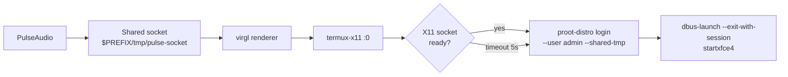
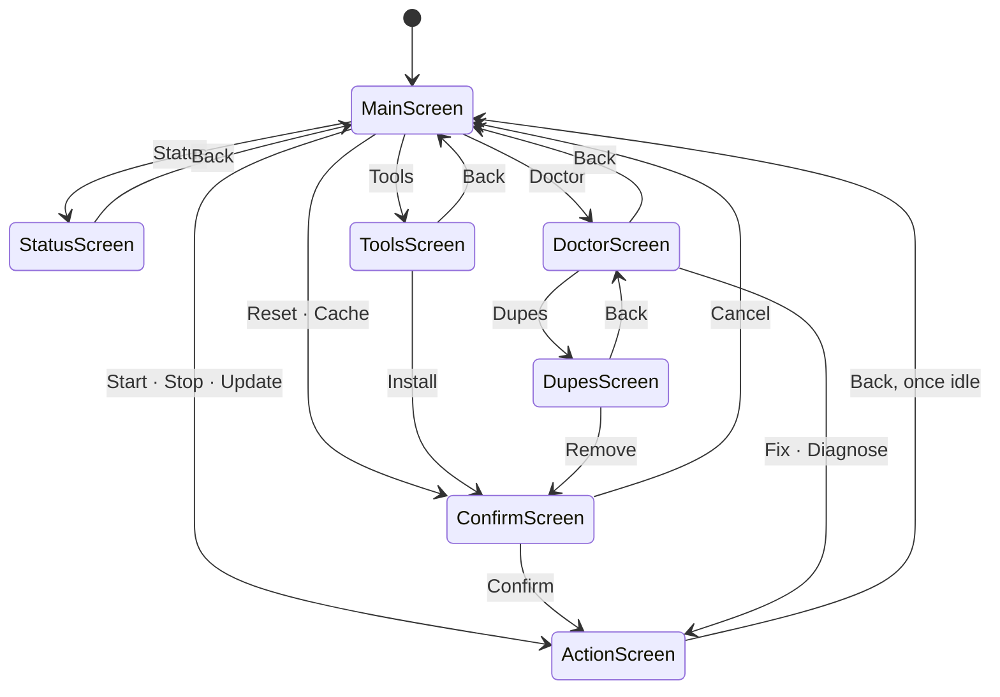
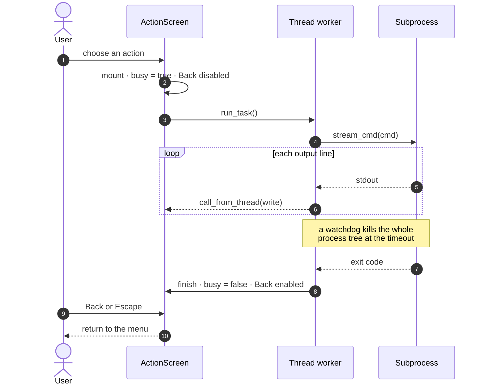

<div align="center">
  <h1>📱 arinanoLabs</h1>
  <p><strong>Your phone is a Linux workstation — ~30s to a working desktop, not 30 minutes of apt.</strong></p>
  <p>
    <a href="https://github.com/arinadi/arinanoLabs/actions"></a>
    <a href="https://github.com/arinadi/arinanoLabs/blob/main/LICENSE"></a>
  </p>

  ```bash
  curl -sL https://raw.githubusercontent.com/arinadi/arinanoLabs/main/install.sh | bash
  ```

  
  <p>
    Debian 13 &nbsp;·&nbsp; Xfce4 &nbsp;·&nbsp; Firefox ESR &nbsp;·&nbsp; Dev tools<br>
    <small>TermuX → X11 → LinuX → Trixie → Xfce4</small>
  </p>
</div>

---

## ⚡ Why

Your Android phone is a pocket PC with 8GB+ RAM and an ARM64 CPU — it deserves a real desktop. If you've already fought your way through a manual proot install, you know where the pain is. arinanoLabs fixes it declaratively:

| Problem | arinanoLabs Solution |
|---------|----------------------|
| Chrome sleeps tabs | Firefox ESR desktop browser — stays alive |
| No glibc apps | Debian 13 proot — standard glibc |
| 30 min of apt + config | Pre-built OCI image, pulled in one step |
| Fiddly X11 + audio + dbus startup | One menu entry, with cleanup on stop |
| Teardown that leaves stale locks | One teardown path, verified before it reports success |

**What this can't do:** no Docker, no systemd services, no native x86, no root (proot emulates root-like behavior, not real root). Full details in [Limitations](#️-limitations).

---

## 🚀 Quick Start

### Install (one-time)

```bash
curl -sL https://raw.githubusercontent.com/arinadi/arinanoLabs/main/install.sh | bash
```

`install.sh` is deliberately thin — it gets git, Python, and this repo onto the
machine, then hands over to `~/arinanoLabs/install.py`, which does the rest:
Python libraries, Termux packages (proot-distro, Termux:X11, PulseAudio,
graphics), the Debian container, and the `alabs` launcher.

The launcher is symlinked into `$PREFIX/bin`, which is Termux's entire default
PATH — so `alabs` works immediately, in the session that ran the installer, with
no shell startup file touched. Off Termux it falls back to `~/bin` and adds that
to PATH in both `.bashrc` and `.profile`.

It runs unattended and is safe to re-run — each step skips work already done,
so a partial install can be resumed by running it again.

**One thing it cannot do for you:** the desktop renders inside the
[Termux:X11 Android app](https://github.com/termux/termux-x11/releases/tag/nightly),
which has to be sideloaded — `pkg` only provides the Termux half. The installer
checks for it and says so at the end if it is missing, and Status reports it too.

Then open a new terminal session:

### Daily Use

```bash
alabs                  # Launch the TUI
```

The menu is two rows of buttons, sized for a thumb:

| | | |
|---|---|---|
| **Start Desktop** | **Stop Desktop** | |
| Update | Tools | Status |
| Doctor | Reset | Cache |

Everything is tappable — Termux delivers touches as mouse events. Full
reference below in [The TUI, screen by screen](#-the-tui-screen-by-screen).

---

## 🏗️ How It Works

Two layers. The **core** is declarative — defined by `image/Dockerfile`, built in
CI, published to `ghcr.io/arinadi/arinanolabs`. The **user layer** is whatever
you install inside the running container; it survives across desktop restarts,
but a Reset wipes it.

Starting the desktop is a chain, and each link is cleaned up in reverse on stop:



### Python TUI

Built with [Textual](https://github.com/Textualize/textual). Every action runs
in a thread worker, so a ten-minute image pull streams into a log pane while
the interface stays live.

Every screen returns to the menu, and anything destructive is gated behind a
confirmation first:



`ActionScreen` is where the long work happens. It hands the job to a thread so
the terminal keeps redrawing, and refuses to be dismissed until that thread is
done — leaving mid image pull would strand a half-installed container:



---

## 🖥️ The TUI, screen by screen

<!-- screenshot: main menu -->

### Start Desktop

Brings the whole stack up in order, streaming each step:

1. **Wake lock** — `termux-wake-lock`, so Android does not freeze the session
2. **Audio server** — PulseAudio plus a Unix socket in the shared tmp, which
   is what the container opens
3. **virgl renderer** — first one that exists, or software rendering
4. **ICE socket directory** — `/tmp/.ICE-unix`, which `xfce4-session` needs to
   accept its own children and which nothing else on this stack creates
5. **X11 server** — `termux-x11 :0`, then opens the Termux:X11 app
6. **Wait for the socket** — until it accepts a connection, not merely exists
7. **Session** — `dbus-launch --exit-with-session xfce4-session` as `admin`

It always runs a full stop first, even when nothing appears to be running.
Leftovers outlive the session that made them, and a stale `.X0-lock` or an
orphaned proot is exactly what breaks the next start.

If the desktop does not come up, a **full diagnostic report is collected
automatically** — no need to go and ask for it. With no container installed,
Start offers to pull one instead of failing further down.

### Stop Desktop

<!-- screenshot: stop -->

Innermost first, which is the opposite of what feels natural:

1. `TERM` then `KILL` this container's proot tree — proot runs with
   `--kill-on-exit`, so that takes everything inside with it
2. X11 down, then the Android app force-stopped
3. `pulseaudio --kill`, virgl down
4. Sweep anything that outlived its parent
5. Remove sockets, lock files and runtime directories

There is no polite logout step. `xfce4-session-logout` reaches the session
manager over its D-Bus and ICE sockets, and a fresh `proot-distro login` has
neither, so the request never arrived — every stop just waited eight seconds
and then killed anyway. `TERM` before `KILL` still lets the tree exit on its
own.

Then it **verifies with `pgrep` and tells you what survived**, rather than
printing "Stopped" regardless.

### Update

`git pull --ff-only`, falling back to a hard reset on `origin/main` when the
fast-forward is refused. When it finishes, a **Restart** button relaunches
`alabs` on the code that was just pulled — pulling into a running process
otherwise does nothing, since the old modules are already loaded.

### Tools

<!-- screenshot: tools search -->

A package browser for the container.

Type a name and press Enter to search the container's package lists. Results
show an **I** against anything already installed, then highlight a row and
press **Install**. apt runs inside the container with its output streamed;
Termux is not touched.

The first search fetches the package lists, which takes a moment. The image
ships without them — every Dockerfile layer ends with
`rm -rf /var/lib/apt/lists/*` to keep the download small — so without this
every search would match nothing and read as "no such package".

An output pane below the results shows the command and its raw output, because
a failed search and an empty one otherwise look identical.

**Mirror** switches which Debian mirror the container fetches from. It leaves
the security stanza alone — Debian 13's `debian.sources` carries the main
archive and security as two separate stanzas at different paths, and a mirror
repointed for both sends security requests somewhere it likely does not carry,
which is what `apt update` exiting 100 after a switch usually means. If the
new mirror still fails, the previous sources are restored automatically. The list is
not hardcoded: **Refresh** pulls Debian's own deb822 masterlist and keeps the
nearby countries, and **Measure** times a real download from each and sorts by
throughput. `netselect-apt` does something similar but ranks by latency and
writes the old sources format, neither of which suits a phone on mobile data.

**Repos** adds third-party apt repositories, each with its own signing key
under `/etc/apt/keyrings` so apt verifies it the way it verifies Debian:

| Repo | What it gives you |
|------|-------------------|
| `backports` | Newer packages from Debian itself — no new key |
| `mozilla` | Firefox tracking release rather than ESR |
| `vscode` | Visual Studio Code |

Search terms and package names are validated against the Debian package-name
shape and rejected rather than escaped — they end up in a shell command.

### Status

<!-- screenshot: status -->

Internet, free storage, Python, proot-distro, the Termux:X11 package **and**
the Android app, the container, whether the desktop is running, image cache
size, and the version.

Three states, not two: ● present, ○ missing, and **? for could not tell**.
Querying installed Android apps is unreliable from Termux, and reporting
"missing" when the honest answer is "unknown" sends you fixing the wrong thing.

### Doctor

<!-- screenshot: doctor -->

Repository checkout, launcher target, Textual, proot-distro, PulseAudio,
Termux:X11, the GPU renderer, the X11 app, the container, stale X11 sockets,
and Firefox's video defaults.

**GPU renderer** is `virglrenderer-android`. Without it the desktop runs on
llvmpipe — everything is drawn on the CPU.

That last one is the fix for stuttering YouTube. There is no VA-API through
proot, so VP9 and AV1 are decoded on the CPU — and that, not rendering, is what
makes playback bad. The repair drops a preferences file into the container that
turns both off, so YouTube falls back to H.264. They are defaults rather than
locks: `about:config` still wins.

VirGL does not solve this. It accelerates OpenGL, and the cost of a video is in
decoding it.

**Audio** works the same way as Bench, because no single method works
everywhere. Three have failed here already: TCP where the module loaded but
nothing listened, a Unix socket that connected and then failed its handshake,
and shared memory that does not survive the proot boundary.

So the methods are declared and tested end to end, and the one that plays is
written to `.env` and used by every later start:

| Method | Transport |
|--------|-----------|
| `unix` | Socket in the shared tmp, shared memory off |
| `unix-shm` | Same socket, shared memory on |
| `tcp` | Loopback TCP, shared memory off |
| `tcp-shm` | Loopback TCP, shared memory on |

It plays from Termux first. If that fails, nothing in the container will help
and it stops there rather than testing four methods against a dead sink.

**Bench** answers a question this project could not answer from the outside.
The published guidance is written for Qualcomm hardware — zink is reported to
work only there, Turnip is Adreno-only — so on an Exynos or Mali device the
right configuration is genuinely unknown.

So it measures. glmark2 runs under each configuration in turn and the winner
is written to `.env`, to be used by every later start:

| Preset | Path |
|--------|------|
| `software` | llvmpipe — the baseline that says whether acceleration helped |
| `virgl` | `virgl_test_server_android`, works on most devices |
| `angle` | virgl → ANGLE → Vulkan, the Mali path |
| `angle-null` | ANGLE with the null Vulkan loader |
| `zink` | OpenGL on Vulkan, reported to work only on Qualcomm |

It needs termux-x11 running, but not the desktop.

**Recording is not possible**, and no amount of configuration changes that. The
Termux app does not declare `android.permission.RECORD_AUDIO`, so PulseAudio
has no microphone source — `module-sles-source` fails to initialise, and
forcing it yields silence rather than audio. `termux-microphone-record` from
Termux:API works, but it is a separate app and cannot feed the container.

| Button | What it does |
|--------|--------------|
| **Re-scan** | Run the checks again |
| **Fix (N)** | Repair everything repairable, in one press |
| **Diagnose** | The same full report Start prints when it fails |
| **Dupes** | Tools installed in both Termux and the container |
| **Audio** | Play a test tone from Termux, then from the container |
| **Bench** | Measure each GPU configuration and keep the fastest |

Only genuinely fixable problems are counted in **Fix**. Anything needing you —
a missing APK, no checkout — says so instead of offering a button that cannot
help.

**Diagnose** reports host processes and sockets, then probes inside the
container: the admin user, the session binaries, the shared socket, `xset q`
against the display, and a foreground session run. It ends with a short guide
to reading it.

**Dupes** lists tools present on both sides and can uninstall the Termux
copies, treating the container as primary. Only packages the container is
confirmed to provide are offered, nothing arinanoLabs itself needs is ever a
candidate, and it is deliberately not part of **Fix** — removing packages from
your Termux is a decision, not a repair.

### Reset and Cache

**Reset** deletes the container and pulls a fresh image. **Cache** drops
downloaded OCI layers and keeps the container. Both go through a confirmation
that spells out what is lost.

### Copying anything

Every screen that produces output — logs, Status, Doctor, Dupes, Tools — has a
**C** button and a `c` key. It tries the Android clipboard via
`termux-clipboard-set`, then the terminal's own OSC 52, and **always mirrors
the text to a file** as well, because the usual reason to copy a failure is to
paste it somewhere for help and neither clipboard is guaranteed.

The button is a letter rather than a clipboard glyph — Termux's font cannot be
relied on to have one.

### Keys

| Key | Where |
|-----|-------|
| `q` | Quit, from the menu |
| `Escape` | Back — refused while an action is still running |
| `c` | Copy the screen's output |
| `Enter` | Run the search, in Tools |

The layout holds down to a 36-column terminal, well under a typical Termux
portrait width. A test drives every screen at 40, 45 and 60 columns.

---

## 📦 What's Included

### In the image

The image is currently a **vanilla baseline**, deliberately. It matches the
established Termux + proot + XFCE recipe and adds nothing beyond a browser:

| Category | Packages |
|----------|----------|
| 🖥️ Desktop | `xfce4`, `xfce4-terminal`, `dbus-x11` |
| 🌐 Browser | `firefox-esr` |
| 🎮 Graphics | Mesa userspace, `x11-xserver-utils`, `mesa-utils` |
| 🔊 Audio | `pulseaudio-utils` (client; the server runs in Termux) |
| 🧱 Base | `ca-certificates`, `locales`, `sudo` |

Installed **with** recommends, as every published guide does. An earlier image
used `--no-install-recommends` throughout and produced a container where
`xfce4-session` started but never launched `xfwm4` or `xfdesktop`.

The dev toolchain, Zsh, on-screen keyboard, theming and the pre-baked panel
layout were removed to get back to a build of known-good shape. They are in git
history and come back once the baseline is confirmed working.

Anything else is a search away in [Tools](#tools).

---

## 🎮 Graphics

There is no GPU vendor detection. The start sequence probes for a virgl
renderer and takes the first one that exists:

| Probe | Used when |
|-------|-----------|
| `virgl_test_server_android` | present on `PATH` (Termux `virglrenderer-android`) |
| ANGLE `vulkan-null` backend | `$PREFIX/opt/angle-android/vulkan-null` exists |
| ANGLE `vulkan` backend | `$PREFIX/opt/angle-android/vulkan` exists |
| none | falls back to software rendering |

The container ships Mesa userspace (`libgl1-mesa-dri`, `libglx-mesa0`,
`mesa-utils`) so OpenGL works either way.

---

## 📂 Structure

```
arinanoLabs/
├── install.sh          ← Bootstrap: git, Python, repo checkout
├── install.py          ← Full installer
├── alabs               ← TUI launcher
├── installer/          ← TUI package
│   ├── app.py          ←   Textual app: screens, runners
│   ├── app.tcss        ←   Styling
│   ├── start.py        ←   Desktop lifecycle
│   ├── preflight.py    ←   Environment checks (pure stdlib)
│   ├── system.py       ←   Subprocess helpers
│   └── const.py        ←   Paths and names
│   └── doctor.py       ←   Diagnosis and repair
│   ├── bench.py        ←   GPU benchmark and profile
│   ├── config.py       ←   .env, per-device settings
├── image/              ← System definition (Dockerfile + configs)
├── tests/              ← Headless TUI tests, run by CI
├── docker/dev/         ← Local TUI test harness
└── docs/               ← Debugging notes and references
```

---

## 🔁 Termux and the container overlap

This is by design, and worth knowing before it confuses you. proot-distro binds
the Termux `$PREFIX` into the container at its original path and **appends**
`$PREFIX/bin` to the guest's `PATH`, so Termux's own binaries are reachable
from inside Debian.

Because the append puts Termux last, a tool present in both resolves to the
Debian copy. The Termux one only runs when Debian lacks the tool — which is
precisely when you would not expect it. `--shared-tmp` extends the same overlap
to `/tmp`: the container's `/tmp` *is* the Termux temp directory.

`Doctor → Dupes` lists tools installed on both sides and can uninstall the
Termux copies, on the assumption that the container is where you work. It only
offers packages the container is confirmed to provide, and it will not touch
anything arinanoLabs itself needs — Python, git, proot-distro, Termux:X11,
PulseAudio or the graphics packages are not candidates.

---

## ⚠️ Limitations

| Limitation | Workaround |
|-----------|------------|
| No root | proot provides root-like environment |
| No systemd | Start services manually |
| No GPU passthrough | virgl renderer, software fallback |
| ARM64 only | QEMU for cross-arch (slow) |
| No native X11 | Termux:X11 app required |
| No Docker | proot lacks kernel features |

---

## 🛑 Android 12+ Phantom Process Killer

Background processes can get killed by Android. Disable it:

- **Android 14+:** Developer Options → Disable child process restrictions
- **Android 12–13:** `adb shell settings put global settings_enable_monitor_phantom_procs false`

---

## 📜 License

GPLv3 — see [LICENSE](LICENSE).
